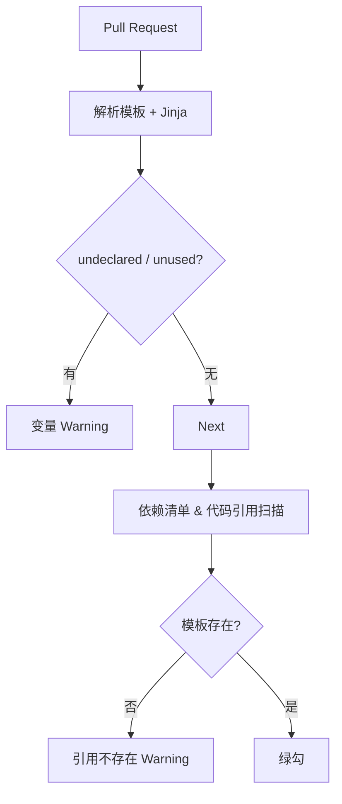

### 1 目标与范围

#### 1.1 功能目标

1. **Jinja2** 模板一等公民：循环、过滤器、`SandboxedEnvironment` 沙箱渲染。
2. **多来源模板发现**：本地文件、远程 HTTP Registry、内存热加载。
3. **不可变 Revision + 可变 Label**：`prod / dev / canary` 随时热切换。
4. **完整 A2A 工作流**：`tool_use` / `tool_result` 均为标准 `kind`，无额外参数。
5. **全链路异步 & 云原生可观测性**：OTel Trace、Prometheus Metric。
6. **A/B 实验**：Gateway 或 SDK 双分流模式，标签化模板版本。

#### 1.2 非目标

* 不内置可视化 CMS；可与 Langfuse、Pezzo 等外部系统集成。
* 不本地运行 LLM；统一调用远程 API。

---

### 2 A2A 消息结构

| 字段        | 含义                            | 说明                                |
| --------- | ----------------------------- | --------------------------------- |
| `role`    | `assistant\|user\|tool`       | 与 OpenAI / Claude 角色对齐            |
| `kind`    | `text\|tool_use\|tool_result` | 枚举来自 A2A 规范                       |
| `content` | 字符串或 JSON                     | `tool_use` 时为 `{name, arguments}` |

---

### 3 核心类与公共 API

#### 3.1 PromptTemplate

```python
class PromptTemplate(BaseModel):
    id: str
    name: str
    version: str
    jinja_source: str
    tags: set[str] = set()

    def format(self, variables: dict, tag: str | None = None) -> list[Message]: ...
    async def run(
        self,
        variables: dict,
        tag: str | None,
        model_option: ModelOption,
    ) -> AsyncGenerator[Message, None]: ...
```

* 使用 `SandboxedEnvironment` 保证安全渲染。
* 缺失变量抛 `ValidationError`。

#### 3.2 PromptEngine

```python
class PromptEngine:
    async def format(self, name: str, variables: dict, tags: str | None = None) -> list[Message]: ...
    async def run(self, name: str, variables: dict, tags: str | None, model_option: ModelOption) -> AsyncGenerator[Message, None]: ...
```

* 多种 `TemplateLoader`（FS / HTTP / Memory）+ `async-lru` TTL 缓存。

#### 3.3 ModelClient

```python
class ModelClient:
    async def run(self, messages: list[Message], **params) -> AsyncGenerator[Message]: ...
```

| 功能          | 方案                                                |
| ----------- | ------------------------------------------------- |
| Provider 适配 | OpenAI: `function_call`; Claude: `tool_use` block |
| HTTP 传输     | `httpx.AsyncClient(http2=True)`                   |
| 重试          | Tenacity 指数退避 + 抖动                                |
| Trace       | OpenTelemetry span                                |
| Metric      | Prometheus `Histogram` / `Counter`                |

---

### 4 Prompt Library 设计文档

#### 4.1 模板文件格式与编写示例

**文件命名** `<namespace>/<name>.jinja`（无版本号）。文件本身是 **完整 YAML**，其中消息内容写在 `messages:` 字段内，支持嵌入 `<a></a>`、`` 等标签；Jinja 语法仅作用于文本字段。

示例：`multi/summary.jinja`

```yaml
version: 2.1
labels: [dev]
required_variables: []
messages:
  - role: system
    parts:
      - type: text
        text: |
          Your role is to act as a helpful summarizer. Provide concise summaries of any text I give you.
  - role: user
    parts:
      - type: text
        text: What is in this image?
      - type: file
        file:
          uri: https://example.com/images/example_image.png
  - role: assistant
    parts:
      - type: text
        text: {{ summary | default('[waiting for model]') }}
```

示例：`support/reply.jinja`

```yaml
version: 1.5
labels: [dev]
required_variables: [name, issue]
messages:
  - role: system
    parts:
      - type: text
        text: You are a customer‑support assistant.
  - role: assistant
    parts:
      - type: text
        text: |
          Hi {{ name }}, your ticket "{{ issue }}" has been created.
          We'll get back soon. <a href="https://support.example.com">View ticket</a>
```

> **解析逻辑**：加载 YAML → 遍历 `messages[*].parts[*]` → 对 `text` 字段执行 Jinja 渲染。

##### 本地渲染示例

```python
import yaml, json
from jinja2 import Environment, StrictUndefined

env = Environment(undefined=StrictUndefined)

tmpl = yaml.safe_load(open("support/reply.jinja"))
for msg in tmpl["messages"]:
    for part in msg.get("parts", []):
        if part.get("type") == "text":
            part["text"] = env.from_string(part["text"]).render(name="Ada", issue="登录失败")
print(json.dumps(tmpl["messages"], indent=2, ensure_ascii=False))
```

CI 只做静态解析：

* YAML → 抽取所有 `{{ var }}` → 比对 `required_variables`；undeclared/unused 输出 *warning*。

---

#### 4.2 版本与兼容策略

* **MAJOR.MINOR** 语义记录在 YAML `version:` 字段。
* 代码侧使用版本约束表达式（`^1`、`~2.1`、`#prod`）解析所需版本。

---

#### 4.3 模板发现与版本控制

| 规则               | 说明                                                 |
| ---------------- | -------------------------------------------------- |
| **Revision**     | 文件路径 + `version:` 组成唯一版本；历史版本由 Registry 存档。        |
| **Label**        | `prod`、`beta` 等映射到 (file, version)；通过后台管理或 API 切换。 |
| **PromptEngine** | 本地 TTL‑LRU 缓存 + SSE 失效（60 s）。                      |

支持 Source：LocalFile、RemoteHTTP、InMemory。

---

#### 4.4 CI/CD 校验链

CI 执行 **两道静态检查**：

1. **变量检查** — 模板 Jinja 占位符 vs. `required_variables`。
2. **引用检查** — 应用依赖清单中的 *template name* 必须在仓库 / Registry 中可解析。



##### prompt.manifest.yaml 示例

依赖文件示例，可放置在项目根目录：

```yaml
# prompt.manifest.yaml
prompts:
  # 任意 1.x.y 且需带 prod 标签
  support/reply: "^1#prod"

  # 2.1.* 范围内最新补丁版本（不筛选标签）
  multi/summary: "~2.1"

  # 精准锁定 3.4.2
  billing/invoice: "3.4.2"

  # 仅通过标签 latest 解析版本
  marketing/welcome: "#latest"

  # 显式区间： >1.0 且 <2.0
  analytics/event: ">1.0 <2.0"
```
```yaml
prompts:
  support/reply: "1.5"
  multi/summary: "^2"
  billing/invoice: "~3.1"
```

* **CI 引用检查** 读取该文件，逐条调用 `HEAD /templates/{name}/{version}` 以确认版本可解析。
* 若未使用 manifest，则脚本回退到 `grep -R "prompt\(" src/` 或 AST 扫描。

---

#### 4.5 运行时安全与容错

* **三段式 Fallback 机制**

  1. **primary** — 正常解析 `(label → version)` 并加载模板。
  2. **previous‑prod** — 若 Registry 不可达或版本下载失败，立即回退到本地缓存中最近一次成功解析且 `label=prod` 的版本。
  3. **minimal fallback** — 若本地亦无缓存或 Jinja 渲染异常，则使用内置极简模板（仅含系统提示，如 "{{error}}. Please retry later."），确保应用返回 200 而非 5xx。

  **示例流程**
  *场景*：`support/reply` 最新 prod = **1.5**，本地仍缓存 1.4。

  | 步骤          | 结果                                                               |
  | ----------- | ---------------------------------------------------------------- |
  | Registry 超时 | 引擎自动回退 **previous‑prod → 1.4**                                   |
  | 渲染阶段变量缺失    | 触发 **minimal fallback**，返回固定文本 "Service temporarily unavailable" |

* **监控指标**
  Prometheus 计数：`prompt_fallback_level{level="previous"}` 与 `prompt_fallback_level{level="minimal"}`；
  OpenTelemetry 在 span 上附加事件 `fallback.level` 并记录 `template_id`, `version`, `label`。

##### 4.5.1 不兼容 prod 版本的升级流程

1. **manifest 锁定主版本** — `support/reply: "^1#prod"` 保证旧实例只解析 **1.x.y**。当运维将 `prod` 标签更新为指向 2.0 时，旧实例会因 MAJOR 不匹配而自动回退到 `previous‑prod`，不中断服务。
2. **灰度升级 / 滚动发布** — 部署新版本应用（代码已兼容 2.x）同时将其 manifest 改为 `support/reply: "^2#prod"`。在滚动过程中，集群中会并存两类副本：

   * **旧副本** 继续请求 `^1#prod` ⟶ 解析 1.5 版本。
   * **新副本** 请求 `^2#prod` ⟶ 解析 2.0 版本。
     观察监控无异常后继续滚动，直至所有副本均升级完毕。
3. **完成升级** — 全部副本升级后，集群只剩下解析 2.0 的流量；若需回滚，仅需把 deployment 回滚或将 `prod` 标签指回 1.x，并重启少量副本触发缓存失效。

> **解析器算法**：先解析 "标签 → 版本"，再检查是否落在 Range；若不兼容则抛异常并走本地回退逻辑。因此旧副本不会误用 2.x 模板，新副本也不会解析 1.x。

---

#### 4.6 参考实现片段

```python
from async_lru import alru_cache
import yaml
from jinja2 import Environment, StrictUndefined

env = Environment(undefined=StrictUndefined)

@alru_cache(maxsize=128, ttl=60)
async def fetch_template(name: str, label: str):
    ...  # 解析版本约束，拉取 YAML 文本

async def render(name: str, label: str, **vars):
    raw_yaml = await fetch_template(name, label)
    data = yaml.safe_load(raw_yaml)
    for msg in data["messages"]:
        for part in msg.get("parts", []):
            if part.get("type") == "text":
                part["text"] = env.from_string(part["text"]).render(**vars)
    return data["messages"]
```

---

### 5 回放（Replay）子系统

#### 5.1 设计目标

1. **确定性复现** — 同一 trace 可在任何时间重放，输出完全一致。
2. **零侵入录制** — `ModelClientRecorder` 内部封装，无业务改动。
3. **流式友好** — 捕获 OpenAI SSE / Claude 增量并原样回放。
4. **跨模型** — 借 §3 转换器，统一录放 OpenAI、Claude、Bedrock。
5. **可观测** — Prometheus & OTel 指标与线上对齐。

#### 5.2 数据模型

JSONL 按行存储：

| 字段           | 说明                                              |
| ------------ | ----------------------------------------------- |
| `session_id` | 会话 UUID                                         |
| `trace_id`   | 单次 `PromptEngine.run()` UUID                    |
| `step`       | 递增序号                                            |
| `direction`  | `req`/`delta`/`res`/`tool_result`/`error`       |
| `timestamp`  | RFC3339 纳秒                                      |
| `payload`    | A2A Message                                     |
| `meta`       | provider / model / latency_ms / status_code … |

#### 5.3 录制流程

```text
direction=req       → 发送前写入
       delta        → 每块 SSE / content‑block 写入
       tool_result  → 本地工具执行完写入
       res          → 模型结束写入
       error        → HTTP 异常写入
```

`aiofiles` 异步落盘，确保无阻塞。文件名：`rollout-<ISO>-<session>.jsonl`。

#### 5.4 ReplayEngine API

```python
class ReplayEngine:
    async def replay(
        self,
        rows: list[dict],
        up_to_step: int | None = None,
        patch: dict[int, list[Message]] | None = None,
    ) -> AsyncGenerator[Message]:
        """按 step 重放，可注入 patch 做 A/B。"""
```

* `req` 行 → 转 Provider 格式发送；若 `patch` 提供同 `step` 的新请求则替换。
* `delta`/`res`/`tool_result` → 直接 yield A2A Message。
* `error` → 抛 `ReplayError` 并计数。

**算法**

```text
for row in sorted(rows, key=step):
    if up_to_step and row.step > up_to_step: break
    switch row.direction:
      req  -> send_to_llm(row or patch)
      delta/res/tool_result -> yield as Message
      error -> raise ReplayError
```

#### 5.5 Prometheus 指标（回放相关）

| 指标                        | 维度          | 含义       |        |        |
| ------------------------- | ----------- | -------- | ------ | ------ |
| `trace_replay_total`      | \`status=ok | diff     | fail\` | 每次回放结果 |
| `trace_diff_tokens_total` | —           | token 偏差 |        |        |

---

### 6 Prometheus 指标总览

| 指标                              | 类型        | 维度                     | 说明             |             |
| ------------------------------- | --------- | ---------------------- | -------------- | ----------- |
| `prompt_load_error_total`       | Counter   | `template_name,reason` | 模板加载失败次数       |             |
| `prompt_fallback_stage_total`   | Counter   | \`stage=previous_prod | minimal\`      | Fallback 命中 |
| `prompt_render_latency_seconds` | Histogram | `template_name`        | Jinja 渲染耗时     |             |
| `prompt_cache_hit_ratio`        | Gauge     | `template_name`        | LRU 命中率        |             |
| `prompt_current_version`        | Gauge     | `template_name,label`  | 当前解析版本 (float) |             |
| `trace_replay_total`            | Counter   | `status`               | 回放结果           |             |
| `trace_diff_tokens_total`       | Counter   | —                      | token 偏差       |             |

> **埋点示例**
>
> ```python
> from prometheus_client import Counter, Histogram, Gauge
> load_err = Counter('prompt_load_error_total', 'Prompt fetch failures', ['template_name','reason'])
> fallback = Counter('prompt_fallback_stage_total', 'fallback hits', ['stage'])
> render_lat = Histogram('prompt_render_latency_seconds', 'Jinja render latency')
> cache_hit = Gauge('prompt_cache_hit_ratio', 'LRU hit ratio', ['template_name'])
> current_ver = Gauge('prompt_current_version', 'resolved version', ['template_name','label'])
> replay = Counter('trace_replay_total', 'replay summary', ['status'])
> diff_tok = Counter('trace_diff_tokens_total', 'token diff')
> ```

---

这样，Prompt Library 的 **模板管理 / 版本策略 / 运行时容错 / CI 校验 / 回放子系统** 全面落地，Prometheus 指标也集中到单一章节，方便运维与监控。
### 7 A/B 实验框架

Prompti 在生产环境支持 **Gateway Split** 与 **SDK Split** 两种模式，模板版本通过
`tag` 形式区分，便于多实验共存。

#### 7.1 分流模式

| 模式 | 决策者 | 部署层级 | 实现 | 优势 |
| --- | --- | --- | --- | --- |
| Gateway Split | Ingress / Service Mesh | L7 网络层 | Istio VirtualService weight / Envoy Gateway backendRef | SLO 回滚、镜像流量 |
| SDK Split | PromptEngine + ExperimentRegistry | Python 进程 | Unleash `% Split`、GrowthBook CDN 等 | 无网关也可用，FaaS 友好 |

#### 7.2 数据模型

模板标签包含 `experiment_id=variant`，例如 `clarify_prompt=A`。`ExperimentRegistry`
接口用于查询当前用户在某个实验中的分流结果：

```python
class ExperimentSplit(BaseModel):
    experiment_id: str | None
    variant: str | None

class ExperimentRegistry(Protocol):
    async def get_split(self, prompt: str, user_id: str) -> ExperimentSplit:
        ...
```

#### 7.3 PromptEngine 实现片段

```python
if headers and "x-variant" in headers:             # Gateway Split
    exp_id, variant = headers.get("x-exp", ""), headers["x-variant"]
else:                                              # SDK Split
    split = await registry.get_split(prompt_name, user_id)
    exp_id, variant = split.experiment_id, split.variant

tag = f"{exp_id}={variant}" if exp_id and variant in tmpl.labels else "prod"
ab_counter.labels(exp_id or "none", variant or "control").inc()
```

#### 7.4 哈希算法

```python
def bucket(hash_key: str, split: dict[str, float]) -> str:
    h = xxhash.xxh32(hash_key).intdigest() / 2**32
    total = 0.0
    for v, pct in split.items():
        total += pct
        if h < total:
            return v
    return next(iter(split))
```

与 Unleash stickiness 与 GrowthBook Hash 兼容，保证多实例 50/50 分布。

#### 7.5 指标

| 指标 | labels | 说明 |
| --- | --- | --- |
| `prompt_ab_request_total` | `experiment,variant` | 每次调用加 1 |
| `llm_request_latency_seconds` | `provider,experiment,variant` | 观测延迟 |

实验信息同时写入 OTel span：`ab.experiment` / `ab.variant`。

#### 7.6 插件对接

内置 **UnleashRegistry** 和 **GrowthBookRegistry**，外部框架仅需实现
`ExperimentRegistry` 即可与 PromptEngine 配合。
