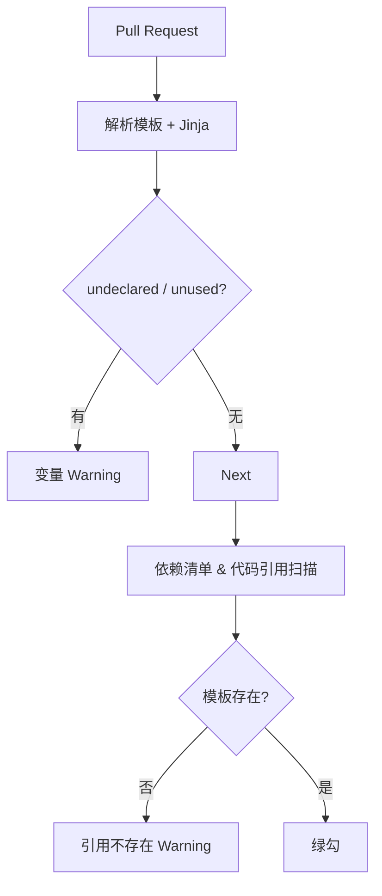

### 4 Prompt Library 设计文档

#### 4.1 模板文件格式与编写示例

**文件命名** `<namespace>/<name>.jinja`（无版本号）。文件本身是 **完整 YAML**，其中消息内容写在 `messages:` 字段内，支持嵌入 `<a></a>`、`` 等标签；Jinja 语法仅作用于文本字段。

示例：`multi/summary.jinja`

```yaml
version: 2.1
labels: [dev]
required_variables: []
messages:
  - role: system
    parts:
      - type: text
        text: |
          Your role is to act as a helpful summarizer. Provide concise summaries of any text I give you.
  - role: user
    parts:
      - type: text
        text: What is in this image?
      - type: file
        file:
          uri: https://example.com/images/example_image.png
  - role: assistant
    parts:
      - type: text
        text: {{ summary | default('[waiting for model]') }}
```

示例：`support/reply.jinja`

```yaml
version: 1.5
labels: [dev]
required_variables: [name, issue]
messages:
  - role: system
    parts:
      - type: text
        text: You are a customer‑support assistant.
  - role: assistant
    parts:
      - type: text
        text: |
          Hi {{ name }}, your ticket "{{ issue }}" has been created.
          We’ll get back soon. <a href="https://support.example.com">View ticket</a>
```

> **解析逻辑**：加载 YAML → 遍历 `messages[*].parts[*]` → 对 `text` 字段执行 Jinja 渲染。

##### 本地渲染示例

```python
import yaml, json
from jinja2 import Environment, StrictUndefined

env = Environment(undefined=StrictUndefined)

tmpl = yaml.safe_load(open("support/reply.jinja"))
for msg in tmpl["messages"]:
    for part in msg.get("parts", []):
        if part.get("type") == "text":
            part["text"] = env.from_string(part["text"]).render(name="Ada", issue="登录失败")
print(json.dumps(tmpl["messages"], indent=2, ensure_ascii=False))
```

CI 只做静态解析：

* YAML → 抽取所有 `{{ var }}` → 比对 `required_variables`；undeclared/unused 输出 *warning*。

---

#### 4.2 版本与兼容策略

* **MAJOR.MINOR** 语义记录在 YAML `version:` 字段。
* 代码侧使用版本约束表达式（`^1`、`~2.1`、`#prod`）解析所需版本。

---

#### 4.3 模板发现与版本控制

| 规则               | 说明                                                 |
| ---------------- | -------------------------------------------------- |
| **Revision**     | 文件路径 + `version:` 组成唯一版本；历史版本由 Registry 存档。        |
| **Label**        | `prod`、`beta` 等映射到 (file, version)；通过后台管理或 API 切换。 |
| **PromptEngine** | 本地 TTL‑LRU 缓存 + SSE 失效（60 s）。                      |

支持 Source：LocalFile、RemoteHTTP、InMemory。

---

#### 4.4 CI/CD 校验链

CI 执行 **两道静态检查**：

1. **变量检查** — 模板 Jinja 占位符 vs. `required_variables`。
2. **引用检查** — 应用依赖清单中的 *template name* 必须在仓库 / Registry 中可解析。



##### prompt.manifest.yaml 示例

依赖文件示例，可放置在项目根目录：

```yaml
# prompt.manifest.yaml
prompts:
  # 任意 1.x.y 且需带 prod 标签
  support/reply: "^1#prod"

  # 2.1.* 范围内最新补丁版本（不筛选标签）
  multi/summary: "~2.1"

  # 精准锁定 3.4.2
  billing/invoice: "3.4.2"

  # 仅通过标签 latest 解析版本
  marketing/welcome: "#latest"

  # 显式区间： >1.0 且 <2.0
  analytics/event: ">1.0 <2.0"
```
```yaml
prompts:
  support/reply: "1.5"
  multi/summary: "^2"
  billing/invoice: "~3.1"
```

* **CI 引用检查** 读取该文件，逐条调用 `HEAD /templates/{name}/{version}` 以确认版本可解析。
* 若未使用 manifest，则脚本回退到 `grep -R "prompt\(" src/` 或 AST 扫描。

---

#### 4.5 运行时安全与容错

* **三段式 Fallback 机制**

  1. **primary** — 正常解析 `(label → version)` 并加载模板。
  2. **previous‑prod** — 若 Registry 不可达或版本下载失败，立即回退到本地缓存中最近一次成功解析且 `label=prod` 的版本。
  3. **minimal fallback** — 若本地亦无缓存或 Jinja 渲染异常，则使用内置极简模板（仅含系统提示，如 "{{error}}. Please retry later."），确保应用返回 200 而非 5xx。

  **示例流程**
  *场景*：`support/reply` 最新 prod = **1.5**，本地仍缓存 1.4。

  | 步骤          | 结果                                                               |
  | ----------- | ---------------------------------------------------------------- |
  | Registry 超时 | 引擎自动回退 **previous‑prod → 1.4**                                   |
  | 渲染阶段变量缺失    | 触发 **minimal fallback**，返回固定文本 "Service temporarily unavailable" |

* **监控指标**
  Prometheus 计数：`prompt_fallback_level{level="previous"}` 与 `prompt_fallback_level{level="minimal"}`；
  OpenTelemetry 在 span 上附加事件 `fallback.level` 并记录 `template_id`, `version`, `label`。

##### 4.5.1 不兼容 prod 版本的升级流程

1. **manifest 锁定主版本** — `support/reply: "^1#prod"` 保证旧实例只解析 **1.x.y**。当运维将 `prod` 标签更新为指向 2.0 时，旧实例会因 MAJOR 不匹配而自动回退到 `previous‑prod`，不中断服务。
2. **灰度升级 / 滚动发布** — 部署新版本应用（代码已兼容 2.x）同时将其 manifest 改为 `support/reply: "^2#prod"`。在滚动过程中，集群中会并存两类副本：

   * **旧副本** 继续请求 `^1#prod` ⟶ 解析 1.5 版本。
   * **新副本** 请求 `^2#prod` ⟶ 解析 2.0 版本。
     观察监控无异常后继续滚动，直至所有副本均升级完毕。
3. **完成升级** — 全部副本升级后，集群只剩下解析 2.0 的流量；若需回滚，仅需把 deployment 回滚或将 `prod` 标签指回 1.x，并重启少量副本触发缓存失效。

> **解析器算法**：先解析 "标签 → 版本"，再检查是否落在 Range；若不兼容则抛异常并走本地回退逻辑。因此旧副本不会误用 2.x 模板，新副本也不会解析 1.x。

---

#### 4.6 参考实现片段 参考实现片段

```python
from async_lru import alru_cache
import yaml
from jinja2 import Environment, StrictUndefined

env = Environment(undefined=StrictUndefined)

@alru_cache(maxsize=128, ttl=60)
async def fetch_template(name: str, label: str):
    ...  # 解析版本约束，拉取 YAML 文本

async def render(name: str, label: str, **vars):
    raw_yaml = await fetch_template(name, label)
    data = yaml.safe_load(raw_yaml)
    for msg in data["messages"]:
        for part in msg.get("parts", []):
            if part.get("type") == "text":
                part["text"] = env.from_string(part["text"]).render(**vars)
    return data["messages"]
```
